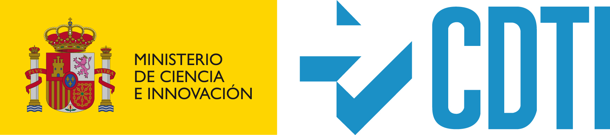

# Intro

Chestnut IoT Platform is a initiative of DIGIO Soluciones Digitales S.L. with the financial support of CDTI (Centro para el Desarrollo Tecnológico Industrial).

Chestnut is a high-performance OpenSource platform created to implement IoT solutions horizontally.

Chestnut includes:

- Hub Services
- Backend and Backoffices Services
- Configuration of K8s for cloud deployment

Chestnut is built on Rust, Crystal Lang and JavaScript to achieve a very versatile platform that can run on any server while achieving a high level of performance.

With the support of:

